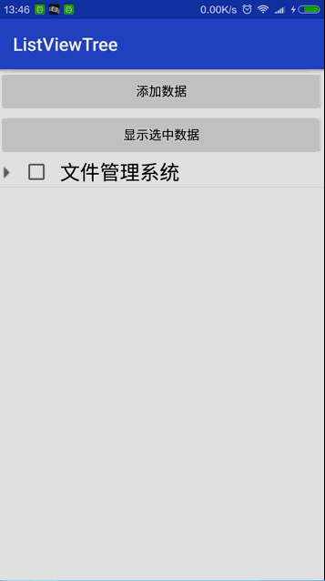

# MultilevelTreeList
Multilevel tree list for Android.

>快速实现Android多级树形列表，这个库是在鸿洋多级树形列表demo中修改而来。

>**解决的问题**：

> 1. 支持ID为int类型和String类型。

> 2. 支持多级复选框选中，使用只需一行代码。

> 3. 支持动态更新数据并保持原有展开/关闭状态。

> 4. 支持ListView、RecyclerView。



## 接入
##### 1. 在全局build里添加仓库
```groovy
    allprojects {
                repositories {
                    ......
                    maven { url 'https://jitpack.io' }
        }
    }
```
##### 2. 在app的build里添加依赖
```groovy
    dependencies {
        implementation 'com.github.zhangke3016:MultilevelTreeList:1.0.0'
    }
```

## 使用

我们关联列表树需要有三个必须元素，当前id、父级id即pid，显示的内容。id和pid可以为int或者String以及其他类型。要显示的内容需要包装一下：

```
//id pid name  FileNode为实际用的实体Bean对象
mlist.add(new Node("223","0","我也是添加的root节点",new FileNode()));
```
对于ListView，需要继承自`TreeListViewAdapter`,如：

```
public class SimpleTreeAdapter extends TreeListViewAdapter
{
    public SimpleTreeAdapter(ListView mTree, Context context, List<Node> datas, int defaultExpandLevel, int iconExpand, int iconNoExpand) {
        super(mTree, context, datas, defaultExpandLevel, iconExpand, iconNoExpand);
    }

    public SimpleTreeAdapter(ListView mTree, Context context, List<Node> datas,
                             int defaultExpandLevel) {
        super(mTree, context, datas, defaultExpandLevel);
    }

    @Override
    public View getConvertView(final Node node , int position, View convertView, ViewGroup parent)
    {

       final ViewHolder viewHolder ;
        if (convertView == null) {
            convertView = mInflater.inflate(R.layout.list_item, parent, false);
            viewHolder = new ViewHolder();
            viewHolder.cb = (CheckBox) convertView
                    .findViewById(R.id.cb_select_tree);
            viewHolder.label = (TextView) convertView
                    .findViewById(R.id.id_treenode_label);
            viewHolder.icon = (ImageView) convertView.findViewById(R.id.icon);
            convertView.setTag(viewHolder);

        } else {
            viewHolder = (ViewHolder) convertView.getTag();
        }
        viewHolder.cb.setOnClickListener(new View.OnClickListener() {
            @Override
            public void onClick(View v) {
                setChecked(node,viewHolder.cb.isChecked());
            }
        });

        if (node.isChecked()){
            viewHolder.cb.setChecked(true);
        }else {
            viewHolder.cb.setChecked(false);
        }

        if (node.getIcon() == -1) {
            viewHolder.icon.setVisibility(View.INVISIBLE);
        } else {
            viewHolder.icon.setVisibility(View.VISIBLE);
            viewHolder.icon.setImageResource(node.getIcon());
        }

        viewHolder.label.setText(node.getName());

        return convertView;
    }

    private final class ViewHolder
    {
        ImageView icon;
        CheckBox cb;
        TextView label;
    }

}

```
对于RecyclerView，需继承自`TreeRecyclerAdapter`,如：

```
public class SimpleTreeRecyclerAdapter extends TreeRecyclerAdapter {

    public SimpleTreeRecyclerAdapter(RecyclerView mTree, Context context, List<Node> datas, int defaultExpandLevel, int iconExpand, int iconNoExpand) {
        super(mTree, context, datas, defaultExpandLevel, iconExpand, iconNoExpand);
    }

    public SimpleTreeRecyclerAdapter(RecyclerView mTree, Context context, List<Node> datas, int defaultExpandLevel) {
        super(mTree, context, datas, defaultExpandLevel);
    }

    @Override
    public RecyclerView.ViewHolder onCreateViewHolder(ViewGroup parent, int viewType) {
        return new MyHoder(View.inflate(mContext, R.layout.list_item,null));
    }

    @Override
    public void onBindViewHolder(final Node node, RecyclerView.ViewHolder holder, int position) {

        final MyHoder viewHolder = (MyHoder) holder;
        //todo do something
        viewHolder.cb.setOnClickListener(new View.OnClickListener() {
            @Override
            public void onClick(View v) {
                setChecked(node,viewHolder.cb.isChecked());
            }
        });

        if (node.isChecked()){
            viewHolder.cb.setChecked(true);
        }else {
            viewHolder.cb.setChecked(false);
        }

        if (node.getIcon() == -1) {
            viewHolder.icon.setVisibility(View.INVISIBLE);
        } else {
            viewHolder.icon.setVisibility(View.VISIBLE);
            viewHolder.icon.setImageResource(node.getIcon());
        }

        viewHolder.label.setText(node.getName());


    }

    class MyHoder extends RecyclerView.ViewHolder{

        public CheckBox cb;

        public TextView label;

        public ImageView icon;
        public MyHoder(View itemView) {
            super(itemView);

            cb = (CheckBox) itemView
                    .findViewById(R.id.cb_select_tree);
            label = (TextView) itemView
                    .findViewById(R.id.id_treenode_label);
            icon = (ImageView) itemView.findViewById(R.id.icon);

        }

    }
}
```
**初始化**：
**ListView**:
```
        //第一个参数  ListView
        //第二个参数  上下文
        //第三个参数  数据集
        //第四个参数  默认展开层级数 0为不展开
        //第五个参数  展开的图标
        //第六个参数  闭合的图标
         mAdapter = new SimpleTreeAdapter(mTree, ListViewActivity.this,
                        mDatas, 1,R.mipmap.tree_ex,R.mipmap.tree_ec);
         mTree.setAdapter(mAdapter);
```
**RecyclerView**：

```
        //第一个参数  RecyclerView
        //第二个参数  上下文
        //第三个参数  数据集
        //第四个参数  默认展开层级数 0为不展开
        //第五个参数  展开的图标
        //第六个参数  闭合的图标
        mAdapter = new SimpleTreeRecyclerAdapter(mTree, RecyclerViewActivity.this,
                mDatas, 1,R.mipmap.tree_ex,R.mipmap.tree_ec);

        mTree.setAdapter(mAdapter);
```
**添加数据**，可以保持原有选中或者展开状态：
```
		List<Node> mlist = new ArrayList<>();
        mlist.add(new Node("223","0","我也是添加的root节点",new FileNode()));
        mAdapter.addData(0,mlist);
```
**获取选中内容**：如果node的isChecked()为true，即为选中状态。

```
    StringBuilder sb = new StringBuilder();
        //获取排序过的nodes
        //如果不需要刻意直接用 mDatas既可
        final List<Node> allNodes = mAdapter.getAllNodes();
        for (int i = 0; i < allNodes.size(); i++) {
            if (allNodes.get(i).isChecked()){
                sb.append(allNodes.get(i).getName()+",");
            }
        }
        String strNodesName = sb.toString();
        if (!TextUtils.isEmpty(strNodesName))
            Toast.makeText(this, strNodesName.substring(0, strNodesName.length()-1),Toast.LENGTH_SHORT).show();
```
**控制父子之间联动的选中与取消状态，只需调用`setChecked`方法既可**，注意如果在`setOnCheckedChangeListener`中处理会有问题：因为如果要子节点/父节点选中或者取消需要刷新页面，而刷新页面又会触发`viewHolder.cb.setChecked(true/false);`的判断从而又会进入`setOnCheckedChangeListener`，会导致如果父节点选中某些子节点取消不了的情况。

```
 //viewHolder.cb 为CheckBox
 viewHolder.cb.setOnClickListener(new View.OnClickListener() {
            @Override
            public void onClick(View v) {
                setChecked(node,viewHolder.cb.isChecked());
            }
        });
```
### About me

A Android Developer in ShenZhen.

【[**我的简书地址**](http://www.jianshu.com/users/3c751e06dc32/latest_articles)】

【[**我的CSDN地址**](http://blog.csdn.net/zhangke3016)】
